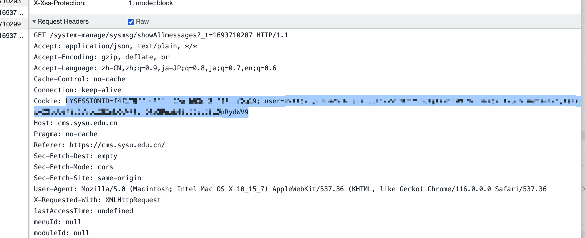

# sysu-ics

把中山大学课程管理系统的课表导出为ics格式的小脚本.

## 使用方法

登陆课程管理系统后, 在随便一个请求里的请求头中拿到cookie, 写入convert.py里的cookie变量里就行, 或者写入COOKIE环境变量中.



设置一下学期号和第一周的第一天(星期日)的日期, 然后

```bash
python convert.py
```

就行

结果保存在result.ics里.
